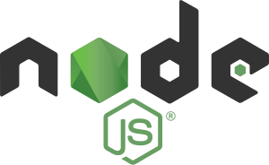

<div align='center'>
  
  <h1>Preguntas de entrevista para Node</h1>
</div>

---
## Índice

- [Índice](#índice)
  - [NPM y Node.js](#npm-y-nodejs)
    - [¿Qué es NPM?](#que-es-npm)
    - [¿Qué es un middleware?](#que-es-un-middleware)
    - [¿Qué es el `package.json` y `package-lock.json`?](#que-es-el-packagejson-y-package-lockjson)
  - [APIs](#apis)
    - [¿Qué es un RESTful API?](#que-es-un-restful-api)
    - [¿Qué es GraphQL?](#que-es-graphql)
  - [HTTP](#http)
    - [¿Para qué sirven los métodos HEAD y OPTION?](#para-que-sirven-los-metodos-head-y-option)
    - [¿Qué significan los estados 1xx, 2xx, 3xx, 4xx, 5xx?](#que-significan-los-estados-1xx-2xx-3xx-4xx-5xx)
    - [¿Qué es CORS?](#que-es-cors)
---

### NPM y Node.js

#### ¿Qué es NPM?
NPM (Node Package Manager) es un administrador de paquetes de software para el lenguaje de programación JavaScript. Se utiliza principalmente para instalar y gestionar módulos de código reutilizable que se pueden utilizar en proyectos de JavaScript.

Los módulos de NPM son código JavaScript escrito por otros desarrolladores que se pueden utilizar en tus proyectos. Al utilizar NPM, puedes instalar y utilizar estos módulos de forma fácil y rápida, lo que te permite ahorrar tiempo al no tener que escribir todo el código necesario desde cero.

Para utilizar NPM, primero debes instalar Node.js en tu ordenador. Node.js es un entorno de tiempo de ejecución de JavaScript que te permite ejecutar código JavaScript en tu ordenador, lo que te permite utilizar NPM. Una vez que tienes Node.js instalado, puedes usar el comando npm en tu terminal para instalar y gestionar módulos de NPM.

Ejemplo de uso:

```bash
npm install express
```

Este comando instala el módulo de NPM llamado "express", que es un framework de aplicaciones web para Node.js. Una vez que lo has instalado, puedes utilizar el código de "express" en tu proyecto de JavaScript.

**[⬆ Volver a índice](#índice)**

---

#### ¿Qué es un middleware?
Un middleware en Node.js es una función que se ejecuta entre la recepción de una solicitud y la generación de una respuesta. Se utiliza a menudo para realizar tareas comunes, como validar datos o autenticar usuarios, antes de permitir que la solicitud continúe hacia el siguiente componente de la aplicación.

Un middleware puede ser utilizado para realizar una variedad de tareas, como:

- Validar datos de entrada
- Autenticar usuarios
- Establecer encabezados HTTP
- Realizar tareas de seguridad
- Registrar actividad
- Realizar tareas de redirección

Un middleware se define como una función que toma tres argumentos: la solicitud (request), la respuesta (response) y la función next. La función next es una función que se utiliza para pasar el control a la siguiente función en la cadena de middleware.

Aquí hay un ejemplo de un middleware que se utiliza para establecer un encabezado HTTP en todas las respuestas:

```js
app.use(function(req, res, next) {
  res.setHeader('Content-Type', 'application/json');
  next();
});
```

En este ejemplo, el middleware establece el encabezado "Content-Type" en todas las respuestas con el valor "application/json". Luego, llama a la función next para permitir que la solicitud continúe hacia el siguiente componente de la aplicación.

Los middlewares se utilizan a menudo en aplicaciones de Node.js para realizar tareas comunes y ahorrar tiempo al no tener que escribir el mismo código una y otra vez.

**[⬆ Volver a índice](#índice)**

---

#### ¿Qué es el **package.json** y **package-lock.json**?

`package.json` es un archivo que se encuentra en la raíz de un proyecto de Node.js y contiene información sobre el proyecto y sus dependencias. Es un archivo de configuración que se utiliza para describir el proyecto y sus dependencias, así como para especificar scripts que se pueden ejecutar en el proyecto.

Aquí hay un ejemplo de lo que podría incluir un archivo `package.json`:

```json
{
  "name": "mi-proyecto",
  "version": "1.0.0",
  "description": "Mi proyecto de Node.js",
  "main": "index.js",
  "scripts": {
    "start": "node index.js"
  },
  "dependencies": {
    "express": "^4.17.1"
  }
}
```

En este ejemplo, el archivo `package.json` incluye información sobre el nombre, la versión y la descripción del proyecto, así como el archivo principal del proyecto (`index.js`). También incluye una sección de scripts con un script llamado "start" que se ejecuta con el comando `npm start`. Finalmente, incluye una sección de dependencias que especifica que el proyecto depende del módulo de NPM "express".

`package-lock.json` es un archivo que se genera automáticamente cuando instalas dependencias en tu proyecto utilizando NPM. Contiene información sobre las dependencias y sus versiones exactas que se han instalado en el proyecto. Esto es útil para asegurar que todos los desarrolladores en un proyecto estén utilizando las mismas versiones de las dependencias, lo que puede ayudar a evitar problemas de compatibilidad.

Cuando instalas una dependencia utilizando NPM, se crea un archivo package-lock.json que incluye información detallada sobre las dependencias y sus versiones exactas. Luego, cuando otro desarrollador clona el proyecto y ejecuta npm install, NPM instalará las dependencias especificadas en el archivo `package-lock.json`, asegurando que todos estén utilizando la misma versión.

En resumen, `package.json` es un archivo de configuración que describe tu proyecto y sus dependencias, mientras que `package-lock.json` es un archivo generado automáticamente que contiene información sobre las dependencias y sus versiones exactas instaladas en el proyecto.

**[⬆ Volver a índice](#índice)**

---

### APIs

#### ¿Qué es un **RESTful API**?

Un API RESTful (Application Programming Interface) es un estilo de arquitectura de API que se basa en los principios del protocolo HTTP y en el estilo arquitectónico REST (Representational State Transfer). Un API RESTful es un conjunto de interfaces de programación de aplicaciones que permite que dos sistemas se comuniquen y compartan datos de manera sencilla y estandarizada.

Las API RESTful siguen un conjunto de principios que definen cómo deben diseñarse y utilizarse. Algunos de estos principios son:

- Utilizar los verbos HTTP (GET, POST, PUT, DELETE) para realizar operaciones CRUD (create, read, update, delete) en los recursos.
- Utilizar URIs (Uniform Resource Identifiers) para identificar recursos.
- Utilizar el formato de intercambio de datos JSON para enviar y recibir datos.
- Utilizar códigos de estado HTTP para indicar el resultado de una solicitud.

Un ejemplo de una API RESTful podría ser una API que exponga una serie de operaciones CRUD para manejar usuarios en una aplicación. Por ejemplo, podrías tener una API que exponga las siguientes operaciones:

- `GET /users`: Obtiene una lista de todos los usuarios.
- `GET /users/{id}`: Obtiene la información del usuario con el ID especificado.
- `POST /users`: Crea un nuevo usuario con la información enviada en el cuerpo de la solicitud.
- `PUT /users/{id}`: Actualiza la información del usuario con el ID especificado con la información enviada en el cuerpo de la solicitud.
- `DELETE /users/{id}`: Elimina el usuario con el ID especificado.

En este ejemplo, cada operación se realiza utilizando un verbo HTTP específico y se accede a los recursos mediante URIs. Los datos se envían y reciben en formato JSON y se utilizan códigos de estado HTTP para indicar el resultado de la solicitud.

En resumen, una API RESTful es un estilo de arquitectura de API que sigue un conjunto de principios y utiliza HTTP y REST para permitir que dos sistemas se comuniquen y compartan datos de manera sencilla y estandarizada.

**[⬆ Volver a índice](#índice)**

---


#### ¿Qué es GraphQL?

GraphQL es un lenguaje de consulta y un marco de trabajo creado por Facebook para la recuperación de datos y la manipulación de APIs. Es una alternativa a las APIs RESTful tradicionales y se ha vuelto cada vez más popular en los últimos años debido a su flexibilidad y capacidad para satisfacer las necesidades de datos específicas de los clientes.

En GraphQL, los clientes envían consultas a un servidor que especifican exactamente qué datos necesitan. El servidor responde con los datos solicitados, sin más. Esto es en contraste con las APIs RESTful, donde el cliente solo puede acceder a los datos proporcionados por la API y no puede especificar exactamente qué datos necesita.

Aquí hay un ejemplo de una consulta GraphQL que solicita información sobre un usuario y sus publicaciones:

```graphql
query {
  user(id: 123) {
    name
    posts {
      title
      body
    }
  }
}
```

En esta consulta, se está solicitando información sobre el usuario con el ID 123, incluyendo su nombre y todas sus publicaciones. El servidor respondería con los datos solicitados, como se muestra a continuación:

```graphql
{
  "data": {
    "user": {
      "name": "John Doe",
      "posts": [
        {
          "title": "Mi primer post",
          "body": "Este es mi primer post en mi blog."
        },
        {
          "title": "Mi segundo post",
          "body": "Este es mi segundo post en mi blog."
        }
      ]
    }
  }
}

```

Como puedes ver, GraphQL te permite recuperar solo los datos que necesitas, en lugar de tener que acceder a un conjunto predeterminado de datos proporcionados por la API. Esto puede ser muy útil cuando trabajas con aplicaciones que necesitan acceder a datos de varias fuentes o que tienen requisitos de datos cambiantes.

En resumen, GraphQL es un lenguaje de consulta y marco de trabajo que te permite recuperar y manipular datos de una manera más flexible y personalizada que las APIs RESTful tradicionales.

**[⬆ Volver a índice](#índice)**

---

### HTTP

#### ¿Para qué sirven los métodos HEAD y OPTION?

- **HEAD**:  
  El método `HEAD` es similar al método `GET`, pero en lugar de obtener el cuerpo de la respuesta, solo devuelve los encabezados. Es útil para:
  - Verificar si un recurso está disponible sin descargar su contenido.
  - Obtener información sobre el recurso, como el tamaño o tipo de contenido.
  
  - **OPTIONS**:  
  El método `OPTIONS` se utiliza para solicitar información sobre las opciones de comunicación que admite el servidor para un recurso específico. También es usado en el proceso de negociación de CORS para determinar qué métodos y encabezados están permitidos en una solicitud.

#### ¿Qué significan los estados 1xx, 2xx, 3xx, 4xx, 5xx?

Los códigos de estado HTTP son respuestas estándar que indican el resultado de una solicitud. Se agrupan en cinco categorías principales:

  - **1xx (Informativos)**:  
    - Indican que la solicitud se recibió y se está procesando.
    - Ejemplo: 100 Continue, 101 Switching Protocols.
  
  - **2xx (Éxito)**:  
    - Indican que la solicitud fue recibida, entendida y aceptada correctamente.
    - Ejemplo: 200 OK, 201 Created, 204 No Content.

  - **3xx (Redirecciones)**:  
    - Indican que se requiere una acción adicional para completar la solicitud.
    - Ejemplo: 301 Moved Permanently, 302 Found, 304 Not Modified.

  - **4xx (Errores del cliente)**:  
    - Indican problemas con la solicitud enviada por el cliente.
    - Ejemplo: 400 Bad Request, 401 Unauthorized, 404 Not Found.

  - **5xx (Errores del servidor)**:  
    - Indican que el servidor encontró un problema al procesar la solicitud.
    - Ejemplo: 500 Internal Server Error, 502 Bad Gateway, 503 Service Unavailable.

**[⬆ Volver a índice](#índice)**

---

#### ¿Qué es CORS?

CORS (Cross-Origin Resource Sharing) es un mecanismo que permite que recursos restringidos en una página web sean solicitados desde otro dominio diferente al que sirvió el recurso original. Es una política de seguridad implementada por navegadores para prevenir accesos no autorizados.

  - **Propósito**:  
    Proteger las aplicaciones contra ataques de tipo Cross-Site Scripting (XSS) y controlar qué dominios tienen permitido acceder a los recursos.
  
  - **Funcionamiento**:  
    - El navegador envía una solicitud previa (preflight) con el método OPTIONS para verificar los permisos del servidor.
    - El servidor responde con encabezados que indican si la solicitud es permitida.
    - Si el navegador recibe una respuesta positiva, envía la solicitud original.

  - **Encabezados clave**:  
    - `Access-Control-Allow-Origin`: Indica qué orígenes tienen permiso.
    - `Access-Control-Allow-Methods`: Lista los métodos HTTP permitidos.
    - `Access-Control-Allow-Headers`: Lista los encabezados permitidos en la solicitud.

**[⬆ Volver a índice](#índice)**

---


**Preguntas Técnicas de Entrevista: Node.js, Backend, MongoDB y SQL**

##### Node.js
1. ¿Qué es un **middleware** en Express y cómo funciona?  
2. ¿Qué diferencias hay entre **sincronía** y **asincronía** en Node.js?  
3. ¿Qué es el **event loop** en Node.js?  
4. ¿Qué es una **promesa** y cómo difiere de usar callbacks?  
5. ¿Cómo manejarías errores en una aplicación de Node.js?  
6. ¿Qué es el módulo `cluster` en Node.js y cuándo usarlo?  
7. ¿Qué diferencia hay entre `require` y `import` en Node.js?  
8. ¿Cómo implementas un sistema de autenticación usando **JWT** en Node.js?  
9. ¿Cómo usarías `dotenv` para gestionar variables de entorno?  
10. ¿Qué herramientas usarías para monitorear y depurar una aplicación en producción?  

##### Bases de Datos NoSQL (MongoDB)
1. ¿Qué es un **ObjectId** en MongoDB y cómo se genera?  
2. ¿Qué son los índices en MongoDB y cómo afectan el rendimiento de las consultas?  
3. ¿Qué son los pipelines en MongoDB y cómo funcionan?  
4. ¿Qué diferencia hay entre `findOne` y `aggregate` en MongoDB?  
5. ¿Qué son las **operaciones atómicas** en MongoDB y por qué son importantes?  
6. ¿Qué es el modelo de consistencia eventual en bases de datos NoSQL?  

##### Bases de Datos Relacionales (SQL)
1. ¿Qué es una transacción en SQL y cómo se implementa?  
2. ¿Qué es un **JOIN** en SQL y qué tipos existen?  
3. ¿Qué es un `stored procedure` en SQL y cuándo deberías usarlo?  
4. ¿Qué es un **trigger** en SQL y cómo funciona?  
5. ¿Cómo harías un sistema de paginación en una base de datos grande?  
6. ¿Qué es un `connection pool` y por qué es importante?  

##### Conceptos Generales de Backend
1. ¿Qué diferencias hay entre una base de datos relacional y una NoSQL?  
2. ¿Cómo manejarías la conexión a múltiples bases de datos en Node.js?  
3. ¿Qué son las migraciones de base de datos y cómo se gestionan en proyectos Node.js?  
4. ¿Cómo gestionarías datos sensibles como contraseñas en un backend?  
5. ¿Qué es la inyección SQL y cómo prevenirla?  
6. ¿Qué es un **caché** en el contexto de bases de datos y cómo implementarlo en Node.js?  

##### Tecnologías Avanzadas
1. ¿Qué es un **ORM** y cuál usarías con Node.js?  
2. ¿Qué son los **websockets** y cuándo los usarías en un backend?  
